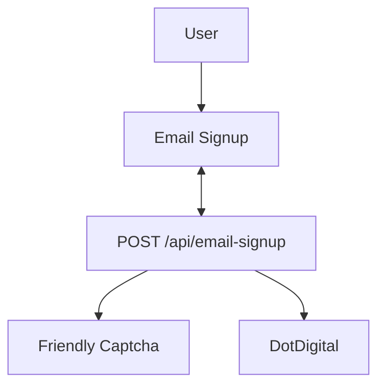

# Email Signup

Newsletter signup for the web app. Collects a first name + email, verifies a
captcha, and creates a contact in DotDigital (our newsletter provider) using
**double opt-in** — so a successful submission leaves the contact *pending*
confirmation until the user clicks the link in the email DotDigital sends them.

## Overview

- **UI:** `packages/design-system/src/molecules/EmailSignup/index.tsx`
- **API route:** `apps/web/src/app/api/email-signup/route.ts` (`POST /api/email-signup`)
- **Types / guard:** `apps/web/src/lib/email-signup/email-signup.ts`
- **Provider client:** `apps/web/src/lib/email-signup/dot-digital.ts`
- **Wiring (CMS block → component):** `apps/web/src/components/shared/ContentBlockRenderer/ContentBlockRenderer.tsx`

## Flow



## Components and responsibilities

| File                       | Responsibility                                                                                                                          |
| -------------------------- | --------------------------------------------------------------------------------------------------------------------------------------- |
| `EmailSignup/index.tsx`    | Renders the form, validates input client-side, gates submit on captcha, POSTs to the API, maps the response to a success/error message. |
| `route.ts`                 | Validates request shape, verifies the captcha server-side, calls DotDigital, maps the provider status to an HTTP status.                |
| `email-signup.ts`          | `EmailForm` type + `isEmailForm` guard, and the shared endpoint config (`defaultEmailForm`).                                            |
| `dot-digital.ts`           | Builds the DotDigital contact payload and calls the DotDigital API.                                                                     |
| `ContentBlockRenderer.tsx` | Supplies the `emailSignup` CMS block with `defaultEmailForm` and `clientConfig.captcha`.                                                |

## Configuration and secrets

Do not store secret values in this doc or in the repo — this is only where they
are sourced from.

| Value | Source | Notes |
| --- | --- | --- |
| Newsletter API credentials | `serverConfig.newsletterEmail.{username,password}` | Basic Auth for DotDigital. Server-only. |
| Captcha API token | `serverConfig.captcha.apiToken` | Server-side verification. |
| Captcha site key | `serverConfig.captcha.siteKey` / `clientConfig.captcha` | Public site key used by the widget and verification. |
| DotDigital list ID | `defaultListId` in `dot-digital.ts` | `30198037` — "My interests 2025 NewSubscribers". |
| DotDigital endpoint | `dotDigitalEndpoint` in `dot-digital.ts` | `https://r1-api.dotdigital.com`. |

## Status and error mapping

DotDigital returns a `status` (or an `errorCode` on failure, which the client
maps to `status`). The route buckets it into an HTTP status; the client turns
that into a user-facing message.

| DotDigital status             | HTTP (route) | UI result                                                        |
| ----------------------------- | ------------ | ---------------------------------------------------------------- |
| `subscribed`                  | 200          | Success text shown                                               |
| `pendingOptIn`                | 200          | Success text shown                                               |
| `noSubscription`              | 200          | Success text shown (treated as pending/benign)                   |
| `contacts:identifierConflict` | 400          | "Already signed up" error text                                   |
| any other status              | 400          | Generic error text                                               |
| shape check fails             | 400          | Generic error text                                               |
| captcha fails                 | 400          | Generic error text (captcha widget also surfaces its own errors) |

## External dependencies

- **DotDigital** — newsletter provider. Contact creation: <https://developer.dotdigital.com/reference/createcontact-1>. Double opt-in (`optInType: verifiedDouble`) means a confirmation email is sent by DotDigital; the user is not fully subscribed until they confirm.
- **Friendly Captcha** — bot protection. Server verification via `@friendlycaptcha/server-sdk`; widget via `@friendlycaptcha/sdk`.

## Gotchas and troubleshooting

The FriendlyCaptcha SDK is the vendor-provided library that handles communication with the FriendlyCaptcha service, allowing the application to verify captcha solutions and manage the captcha widget (for example, resetting it).

### A FriendlyCaptcha outage looks like a failed captcha

`verifyCaptcha()` returns `false` in three different situations:

```ts
if (!result.wasAbleToVerify()) {
  return false;
}

if (!result.shouldAccept()) {
  return false;
}

catch {
  return false;
}
```

These cases mean different things:

- `wasAbleToVerify() === false`  
    FriendlyCaptcha could not complete verification, for example because the service was unavailable or the verification response was incomplete.
    
- `shouldAccept() === false`  
    FriendlyCaptcha successfully checked the token but rejected it because it was invalid, expired, or already used.
    
- the SDK throws  
    A network, SDK, configuration, or unexpected runtime error occurred.
    

All three are converted by `route.ts` into the same response:

```json
{"error":"Failed captcha"}
```

with HTTP `400`.

This means the browser cannot distinguish between:

- a genuinely invalid user token
    
- a FriendlyCaptcha service outage
    
- an SDK or network failure
    
- a configuration problem
    

The response is useful for the UI, but it hides the operational cause. Server-side logging or more specific internal error handling would be required to diagnose the difference.

---

### “Already signed up” depends on an exact Dotdigital error code

The client checks the returned status against this exact string:

```ts
if (code === 'contacts:identifierConflict') {
  setError(alreadySignedUpErrorText);
  resetCaptcha();
  return;
}
```

The value originates from Dotdigital:

```ts
return {
  status: error.errorCode,
};
```

Therefore, the specific “already signed up” message depends on Dotdigital continuing to return:

```text
contacts:identifierConflict
```

If Dotdigital changes the code, casing, or response structure, the condition no longer matches. The request would still fail, but the client would fall through to:

```ts
setError(genericErrorText);
```

This would not crash the feature; it would silently reduce the quality of the user-facing message.

---

### `firstName` mapping has not been confirmed against Dotdigital’s schema

The outgoing contact payload uses:

```ts
dataFields: {
  firstName,
}
```

The source includes:

```ts
firstName: string; // @todo is this correct!?
```

This suggests the project has not fully confirmed that Dotdigital expects the field name `firstName` in this exact form.

Potential issues include:

- Dotdigital may expect a configured data-field key rather than `firstName`
    
- the field may be case-sensitive
    
- the account may use a custom field identifier
    
- the request may succeed while silently failing to store the first name
    

The contact could still be created successfully because the email identifier and list assignment are valid, even if the first-name field is ignored or mapped incorrectly.

---

### Email validation trims for checking but submits the raw value

The client validates the email using a trimmed value for some checks, but the submitted value remains the original string.

For example, a user may enter:

```text
 user@example.com 
```

The validation may treat it as:

```text
user@example.com
```

but the POST body may still contain:

```json
{
  "email": " user@example.com "
}
```

This can cause inconsistent behaviour:

- client validation passes
    
- Dotdigital receives whitespace
    
- Dotdigital may reject it, normalise it, or treat it differently
    
- duplicate detection may behave unexpectedly
    

The safer approach would be to trim the value before storing or before constructing the request payload.

---

### Success handling depends strictly on HTTP `200`

The client treats the request as successful only when:

```ts
response.status === 200
```

The API currently returns `200` for:

```ts
subscribed
pendingOptIn
noSubscription
```

Any non-`200` response is treated as a failure, even if a future API or provider response represents a valid partial or accepted state.

For example, if the API later returned:

```text
202 Accepted
```

for a queued subscription, the client would enter the error branch even though the request may have been accepted successfully.

This is not currently a defect because the route deliberately returns `200` for all recognised completion statuses. It is a maintenance risk if the route’s HTTP contract changes later.
