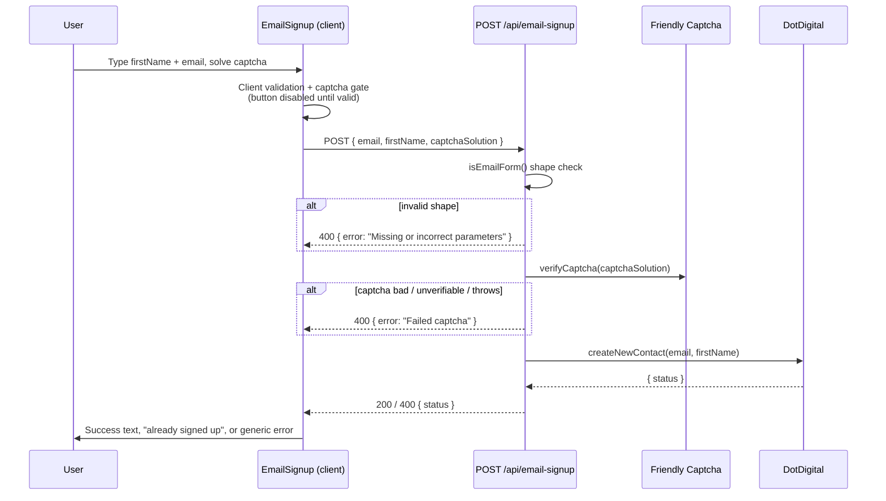

# Email Signup

Newsletter signup for the web app. Collects a first name + email, verifies a
captcha, and creates a contact in DotDigital (our newsletter provider) using
**double opt-in** — so a successful submission leaves the contact *pending*
confirmation until the user clicks the link in the email DotDigital sends them.

## Overview

- **UI:** `packages/design-system/src/molecules/EmailSignup/index.tsx`
- **API route:** `apps/web/src/app/api/email-signup/route.ts` (`POST /api/email-signup`)
- **Types / guard:** `apps/web/src/lib/email-signup/email-signup.ts`
- **Provider client:** `apps/web/src/lib/email-signup/dot-digital.ts`
- **Wiring (CMS block → component):** `apps/web/src/components/shared/ContentBlockRenderer/ContentBlockRenderer.tsx`

## Flow

## Components and responsibilities

| File | Responsibility |
| --- | --- |
| `EmailSignup/index.tsx` | Renders the form, validates input client-side, gates submit on captcha, POSTs to the API, maps the response to a success/error message. |
| `route.ts` | Validates request shape, verifies the captcha server-side, calls DotDigital, maps the provider status to an HTTP status. |
| `email-signup.ts` | `EmailForm` type + `isEmailForm` guard, and the shared endpoint config (`defaultEmailForm`). |
| `dot-digital.ts` | Builds the DotDigital contact payload and calls the DotDigital API. |
| `ContentBlockRenderer.tsx` | Supplies the `emailSignup` CMS block with `defaultEmailForm` and `clientConfig.captcha`. |

## Configuration and secrets

Do not store secret values in this doc or in the repo — this is only where they
are sourced from.

| Value | Source | Notes |
| --- | --- | --- |
| Newsletter API credentials | `serverConfig.newsletterEmail.{username,password}` | Basic Auth for DotDigital. Server-only. |
| Captcha API token | `serverConfig.captcha.apiToken` | Server-side verification. |
| Captcha site key | `serverConfig.captcha.siteKey` / `clientConfig.captcha` | Public site key used by the widget and verification. |
| DotDigital list ID | `defaultListId` in `dot-digital.ts` | `30198037` — "My interests 2025 NewSubscribers". |
| DotDigital endpoint | `dotDigitalEndpoint` in `dot-digital.ts` | `https://r1-api.dotdigital.com`. |

## Status and error mapping

DotDigital returns a `status` (or an `errorCode` on failure, which the client
maps to `status`). The route buckets it into an HTTP status; the client turns
that into a user-facing message.

| DotDigital status | HTTP (route) | UI result |
| --- | --- | --- |
| `subscribed` | 200 | Success text shown |
| `pendingOptIn` | 200 | Success text shown |
| `noSubscription` | 200 | Success text shown (treated as pending/benign) |
| `contacts:identifierConflict` | 400 | "Already signed up" error text |
| any other status | 400 | Generic error text |
| shape check fails | 400 | Generic error text |
| captcha fails | 400 | Generic error text (captcha widget also surfaces its own errors) |

## External dependencies

- **DotDigital** — newsletter provider. Contact creation: <https://developer.dotdigital.com/reference/createcontact-1>. Double opt-in (`optInType: verifiedDouble`) means a confirmation email is sent by DotDigital; the user is not fully subscribed until they confirm.
- **Friendly Captcha** — bot protection. Server verification via `@friendlycaptcha/server-sdk`; widget via `@friendlycaptcha/sdk`.

## Gotchas and troubleshooting

- **A Friendly Captcha outage looks like a "failed captcha".** `verifyCaptcha` returns `false` when it *can't verify* or when the SDK throws, not only when the token is genuinely bad — all three map to `400 "Failed captcha"`.
- **"Already signed up" is matched on a literal string.** The client keys off `contacts:identifierConflict`, which comes straight from DotDigital's `errorCode`. If DotDigital changes it, the specific message silently degrades to the generic error.
- **`firstName` data-field mapping is unconfirmed.** There is a `@todo` in `dot-digital.ts` questioning whether the `dataFields.firstName` mapping matches DotDigital's schema.
- **Whitespace.** The client validates a trimmed email for length but submits the raw value, so leading/trailing whitespace can reach DotDigital.
- **Success is strict.** The client treats only HTTP `200` as success; any future "soft success" non-200 status would show an error screen.
